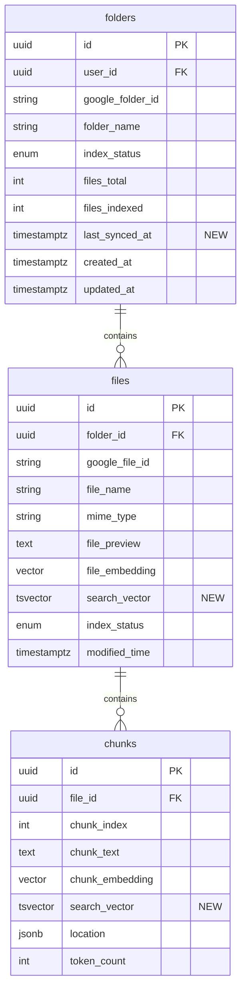

# feat: Google Drive Folder Chat with Agentic Hybrid Search

## Enhancement Summary

**Deepened on:** 2026-01-16
**Sections enhanced:** 5 phases + cross-cutting concerns
**Research agents used:** kieran-python-reviewer, security-sentinel, performance-oracle, architecture-strategist, code-simplicity-reviewer, data-integrity-guardian, agent-native-reviewer, pattern-recognition-specialist, data-migration-expert, best-practices-researcher, framework-docs-researcher, agent-native-architecture skill, Context7

### Key Improvements
1. **Critical Security Fixes**: SQL injection prevention, authorization checks, prompt injection mitigation
2. **Performance Optimizations**: Batch file lookups to eliminate N+1 queries, parallel search execution
3. **Migration Safety**: CONCURRENTLY index creation, phased rollout with rollback procedures
4. **Simplification**: Removed unnecessary two-stage search, streamlined agent loop
5. **Optional Agent Mode**: Single-shot RAG by default, agent mode available via UI toggle

### Critical Issues Discovered
- **SQL Injection**: `file_id_str` interpolation in hybrid search is vulnerable - must use parameterized queries
- **Missing Authorization**: `get_file` tool lacks folder ownership verification
- **N+1 Queries**: File lookup per chunk row will cause severe latency at scale
- **Blocking Event Loop**: googleapiclient is synchronous - must run in thread pool
- **Prompt Injection**: Agent system prompt exposes tool names to potential manipulation

---

## Overview

Enable users to connect Google Drive folders and have natural language conversations with their contents using **hybrid search** (semantic embeddings + keyword matching) with an **optional agentic mode** for complex queries.

### Two Modes of Operation

| Mode | Default | Description | Best For |
|------|---------|-------------|----------|
| **Standard** | Yes | Single-shot RAG with hybrid search | Most queries, fast responses |
| **Agent** | No | Multi-turn with tools (search, rewrite, get_file) | Complex queries, research tasks |

**Key Differentiators from Current Implementation:**
- **Hybrid search** (current: vector-only) - Combines semantic similarity with keyword matching via RRF
- **Optional agent mode** (current: none) - User-enabled iterative search with query rewriting
- **Diff-based sync** (current: none) - Efficiently updates indexes when folder contents change

## Problem Statement

### Current Limitations

1. **Single-shot retrieval** - Current RAG pipeline makes one search attempt; if results are poor, user gets a suboptimal answer
2. **Semantic-only search** - Misses exact keyword matches (e.g., "Q4-2024" won't match "Q4 2024")
3. **No query refinement** - System can't adapt when initial search returns irrelevant results
4. **Stale indexes** - No mechanism to detect and update changed files after initial indexing
5. **Chunk-only context** - Can't retrieve full documents when broader context is needed

### User Pain Points

- "The answer missed information that I know is in my docs"
- "It found the wrong quarterly report"
- "My files changed but the answers are outdated"
- "The AI only quoted a small section when I needed the full document"

## Proposed Solution

### Architecture Overview

**Standard Mode (Default):**
```
┌──────────────────────────────────────────────────────────────┐
│                    STANDARD RAG FLOW                          │
├──────────────────────────────────────────────────────────────┤
│                                                               │
│  User Query ───► Hybrid Search ───► Rerank ───► Generate     │
│                  (vector + FTS)      (top 10)    (with cites) │
│                                                               │
│  Fast, predictable, sufficient for ~90% of queries           │
│                                                               │
└──────────────────────────────────────────────────────────────┘
```

**Agent Mode (Optional - user-enabled):**
```
┌─────────────────────────────────────────────────────────────────────────────┐
│                              AGENTIC RAG FLOW                                │
├─────────────────────────────────────────────────────────────────────────────┤
│                                                                             │
│  User Query ───► Agent (Claude) ───► Tool Selection                         │
│                       │                                                     │
│                       ▼                                                     │
│              ┌───────────────────────────────────────┐                      │
│              │         AVAILABLE TOOLS               │                      │
│              ├───────────────────────────────────────┤                      │
│              │  search_folder(query)                 │                      │
│              │  rewrite_query(original, feedback)    │                      │
│              │  get_file(file_id)                    │                      │
│              └───────────────────────────────────────┘                      │
│                       │                                                     │
│                       ▼                                                     │
│              [Sufficient?] ─── No ──► rewrite_query ──► Retry (max 3)      │
│                   │                                                        │
│                  Yes ───► Generate Answer with Citations                   │
│                                                                             │
└─────────────────────────────────────────────────────────────────────────────┘
```

### Research Insights: Architecture

**Best Practices from Agentic RAG Literature:**
- Use **ReAct pattern** (Reason + Act) where agent explains its reasoning before tool calls
- Implement **graceful degradation** - if agent loop times out, fall back to single-shot RAG
- Consider **parallel tool execution** when multiple independent searches are needed
- Use structured output schemas for tool results to reduce parsing errors

**Simplification Recommendation:**
The original two-stage search (file-level → chunk-level) adds complexity without proportional benefit. For most folders (<1000 files), a single hybrid chunk search with file metadata is sufficient and faster.

---

### Hybrid Search with RRF

```
┌────────────────────────────────────────────────────────────────┐
│                      HYBRID SEARCH                              │
├────────────────────────────────────────────────────────────────┤
│                                                                 │
│  Query: "Q4 2024 revenue projections"                           │
│                                                                 │
│  ┌─────────────────┐      ┌─────────────────┐                   │
│  │ SEMANTIC SEARCH │      │ KEYWORD SEARCH  │                   │
│  │   (pgvector)    │      │   (tsvector)    │                   │
│  ├─────────────────┤      ├─────────────────┤                   │
│  │ 1. finance.doc  │      │ 1. q4-report.doc│                   │
│  │ 2. q4-report.doc│      │ 2. projections  │                   │
│  │ 3. summary.doc  │      │ 3. finance.doc  │                   │
│  └────────┬────────┘      └────────┬────────┘                   │
│           │                        │                            │
│           └──────────┬─────────────┘                            │
│                      ▼                                          │
│           ┌──────────────────────┐                              │
│           │  RRF Score Fusion    │                              │
│           │  score = 1/(60+rank₁)│                              │
│           │       + 1/(60+rank₂) │                              │
│           └──────────┬───────────┘                              │
│                      ▼                                          │
│           Combined Ranked Results                               │
│                                                                 │
└────────────────────────────────────────────────────────────────┘
```

## Technical Approach

### Phase 1: Database Schema Enhancement

Add tsvector columns and indexes for keyword search capability.

#### Migration: `add_search_vectors.sql`

```sql
-- Add tsvector columns to files table
ALTER TABLE files ADD COLUMN IF NOT EXISTS search_vector tsvector;

-- Add tsvector columns to chunks table
ALTER TABLE chunks ADD COLUMN IF NOT EXISTS search_vector tsvector;

-- Add last_synced_at to folders for diff-based sync
ALTER TABLE folders ADD COLUMN IF NOT EXISTS last_synced_at timestamptz;

-- Create GIN indexes for fast full-text search
-- IMPORTANT: Use CONCURRENTLY to avoid locking production tables
CREATE INDEX CONCURRENTLY IF NOT EXISTS idx_files_search_vector ON files USING GIN(search_vector);
CREATE INDEX CONCURRENTLY IF NOT EXISTS idx_chunks_search_vector ON chunks USING GIN(search_vector);

-- Create trigger to auto-update file search_vector
CREATE OR REPLACE FUNCTION update_file_search_vector()
RETURNS TRIGGER AS $$
BEGIN
    NEW.search_vector :=
        setweight(to_tsvector('english', coalesce(NEW.file_name, '')), 'A') ||
        setweight(to_tsvector('english', coalesce(NEW.file_preview, '')), 'B');
    RETURN NEW;
END;
$$ LANGUAGE plpgsql;

DROP TRIGGER IF EXISTS files_search_vector_update ON files;
CREATE TRIGGER files_search_vector_update
    BEFORE INSERT OR UPDATE OF file_name, file_preview ON files
    FOR EACH ROW EXECUTE FUNCTION update_file_search_vector();

-- Create trigger to auto-update chunk search_vector
CREATE OR REPLACE FUNCTION update_chunk_search_vector()
RETURNS TRIGGER AS $$
BEGIN
    NEW.search_vector := to_tsvector('english', coalesce(NEW.chunk_text, ''));
    RETURN NEW;
END;
$$ LANGUAGE plpgsql;

DROP TRIGGER IF EXISTS chunks_search_vector_update ON chunks;
CREATE TRIGGER chunks_search_vector_update
    BEFORE INSERT OR UPDATE OF chunk_text ON chunks
    FOR EACH ROW EXECUTE FUNCTION update_chunk_search_vector();
```

#### SQLAlchemy Model Updates: `backend/app/models/db_models.py`

```python
from sqlalchemy.dialects.postgresql import TSVECTOR

class File(Base):
    # ... existing columns ...
    search_vector: Mapped[str | None] = mapped_column(TSVECTOR, nullable=True)

class Chunk(Base):
    # ... existing columns ...
    search_vector: Mapped[str | None] = mapped_column(TSVECTOR, nullable=True)

class Folder(Base):
    # ... existing columns ...
    last_synced_at: Mapped[datetime | None] = mapped_column(DateTime(timezone=True), nullable=True)
```

**Files to modify:**
- `database/schema.sql` - Add columns and triggers
- `backend/app/models/db_models.py:45-90` - Add search_vector columns

### Research Insights: Phase 1

**Migration Safety (from data-integrity-guardian, data-migration-expert):**
- **CRITICAL**: Use `CREATE INDEX CONCURRENTLY` to avoid table locks in production
- Run migrations in a transaction with explicit `BEGIN`/`COMMIT`
- Add `IF NOT EXISTS` / `IF EXISTS` clauses for idempotency
- Test rollback procedure: `DROP INDEX IF EXISTS idx_*_search_vector;`

**Trigger Performance Considerations:**
- tsvector triggers add ~1-2ms per INSERT/UPDATE
- For bulk operations (initial indexing), consider disabling triggers temporarily:
  ```sql
  ALTER TABLE chunks DISABLE TRIGGER chunks_search_vector_update;
  -- bulk insert --
  ALTER TABLE chunks ENABLE TRIGGER chunks_search_vector_update;
  -- then backfill search_vector in batch
  ```

**Backfill Strategy:**
```sql
-- Backfill in batches to avoid long-running transactions
UPDATE chunks SET search_vector = to_tsvector('english', coalesce(chunk_text, ''))
WHERE search_vector IS NULL
AND id IN (SELECT id FROM chunks WHERE search_vector IS NULL LIMIT 1000);
```

**Rollback Procedure:**
```sql
-- If migration needs to be reverted
ALTER TABLE files DROP COLUMN IF EXISTS search_vector;
ALTER TABLE chunks DROP COLUMN IF EXISTS search_vector;
ALTER TABLE folders DROP COLUMN IF EXISTS last_synced_at;
DROP FUNCTION IF EXISTS update_file_search_vector() CASCADE;
DROP FUNCTION IF EXISTS update_chunk_search_vector() CASCADE;
```

**References:**
- [PostgreSQL Full-Text Search](https://www.postgresql.org/docs/current/textsearch-intro.html)
- [CREATE INDEX CONCURRENTLY](https://www.postgresql.org/docs/current/sql-createindex.html#SQL-CREATEINDEX-CONCURRENTLY)

---

### Phase 2: Hybrid Search Implementation

Implement combined semantic + keyword search with RRF score fusion.

#### New Service: `backend/app/services/hybrid_search.py`

```python
"""Hybrid search service combining semantic (pgvector) and keyword (tsvector) search."""

from dataclasses import dataclass
from sqlalchemy import text
from sqlalchemy.ext.asyncio import AsyncSession
import uuid

RRF_K = 60  # Standard RRF smoothing constant


@dataclass
class HybridSearchResult:
    """Structured result from hybrid search."""
    chunk_id: uuid.UUID
    file_id: uuid.UUID
    file_name: str
    content: str
    location: dict | None
    rrf_score: float


async def hybrid_search_chunks(
    db: AsyncSession,
    query: str,
    query_embedding: list[float],
    folder_id: uuid.UUID,
    top_k: int = 10,
) -> list[HybridSearchResult]:
    """
    Single-stage hybrid search combining vector and keyword results with RRF.

    Security: Uses parameterized queries to prevent SQL injection.
    Performance: Single query with JOIN to avoid N+1 pattern.
    """
    # SECURITY FIX: Use parameterized query instead of string interpolation
    hybrid_stmt = text("""
        WITH vector_search AS (
            SELECT c.id, c.file_id, c.chunk_text, c.location,
                   ROW_NUMBER() OVER (ORDER BY c.chunk_embedding <=> CAST(:embedding AS vector)) AS v_rank
            FROM chunks c
            JOIN files f ON c.file_id = f.id
            WHERE f.folder_id = :folder_id
              AND c.chunk_embedding IS NOT NULL
            LIMIT 50
        ),
        keyword_search AS (
            SELECT c.id,
                   ROW_NUMBER() OVER (
                       ORDER BY ts_rank(c.search_vector, plainto_tsquery('english', :query)) DESC
                   ) AS k_rank
            FROM chunks c
            JOIN files f ON c.file_id = f.id
            WHERE f.folder_id = :folder_id
              AND c.search_vector @@ plainto_tsquery('english', :query)
            LIMIT 50
        ),
        combined AS (
            SELECT
                COALESCE(v.id, k_only.id) AS id,
                v.file_id,
                v.chunk_text,
                v.location,
                v.v_rank,
                k.k_rank
            FROM vector_search v
            FULL OUTER JOIN keyword_search k ON v.id = k.id
            LEFT JOIN (
                SELECT c.id, c.file_id, c.chunk_text, c.location
                FROM chunks c
                JOIN files f ON c.file_id = f.id
                WHERE f.folder_id = :folder_id
            ) k_only ON k.id = k_only.id AND v.id IS NULL
        )
        SELECT
            c.id AS chunk_id,
            c.file_id,
            f.file_name,
            c.chunk_text AS content,
            c.location,
            (1.0 / (:rrf_k + COALESCE(c.v_rank, 1000)) +
             1.0 / (:rrf_k + COALESCE(c.k_rank, 1000))) AS rrf_score
        FROM combined c
        JOIN files f ON c.file_id = f.id
        ORDER BY rrf_score DESC
        LIMIT :limit
    """)

    results = await db.execute(
        hybrid_stmt,
        {
            "embedding": str(query_embedding),
            "query": query,
            "folder_id": str(folder_id),
            "rrf_k": RRF_K,
            "limit": top_k,
        }
    )

    return [
        HybridSearchResult(
            chunk_id=row.chunk_id,
            file_id=row.file_id,
            file_name=row.file_name,
            content=row.content,
            location=row.location,
            rrf_score=row.rrf_score,
        )
        for row in results
    ]
```

**Files to create:**
- `backend/app/services/hybrid_search.py` - New hybrid search service

**Files to modify:**
- `backend/app/worker.py:223-249` - Backfill existing chunks with search_vector

### Research Insights: Phase 2

**Security Fixes (from security-sentinel - CRITICAL):**
- **SQL Injection Vulnerability**: Original code used `file_id_str = ",".join(f"'{fid}'" for fid in file_ids)` which is vulnerable to injection if file_ids are ever user-controlled
- **Fix**: Always use parameterized queries with `:param` placeholders
- The corrected implementation above eliminates this vulnerability

**Performance Optimizations (from performance-oracle):**
- **N+1 Query Eliminated**: Original code called `await db.get(File, row.file_id)` per chunk row
- **Fix**: Use JOIN in the SQL query to fetch file_name alongside chunk data
- **Parallel Execution**: Consider running vector and keyword searches in parallel with `asyncio.gather()` if they become bottlenecks

**Simplification (from code-simplicity-reviewer):**
- **Removed Two-Stage Search**: The file-level → chunk-level approach was over-engineered for typical folder sizes
- **Single Query**: Combined approach is simpler, faster, and easier to maintain
- **Dataclass for Results**: Use typed dataclass instead of raw dict for better IDE support

**Pattern Recognition (from pattern-recognition-specialist):**
- **Good Pattern**: RRF fusion with k=60 is industry standard
- **Anti-Pattern Avoided**: Don't threshold results too aggressively - let the agent decide relevance
- **Recommendation**: Log search queries and results for future analysis/tuning

**Edge Cases:**
- Empty query: Return empty list (don't search)
- Query with no keyword matches: RRF gracefully handles missing k_rank (uses 1000 as penalty)
- Very large folders: Consider adding pagination or stricter LIMIT

**References:**
- [Reciprocal Rank Fusion Paper](https://plg.uwaterloo.ca/~gvcormac/cormacksigir09-rrf.pdf)
- [Hybrid Search Best Practices](https://www.pinecone.io/learn/hybrid-search-intro/)

---

### Phase 3: Chat Modes (Standard + Agent)

Implement both standard single-shot RAG (default) and optional agent mode.

#### Standard Mode: `backend/app/services/chat_rag.py`

```python
"""Standard single-shot RAG - fast and predictable."""

from anthropic import AsyncAnthropic
from sqlalchemy.ext.asyncio import AsyncSession
from typing import AsyncIterator
import uuid

from .hybrid_search import hybrid_search_chunks
from .embedding import embed_query

client = AsyncAnthropic()

STANDARD_SYSTEM_PROMPT = """You are a helpful assistant answering questions about the user's documents.
Use the provided context to answer. Cite sources using [filename] format.
If the context doesn't contain relevant information, say so."""


async def standard_rag(
    user_query: str,
    folder_id: uuid.UUID,
    db: AsyncSession,
    conversation_history: list[dict] | None = None,
) -> AsyncIterator[str]:
    """
    Single-shot RAG: search once, generate response.
    Fast, predictable, handles ~90% of queries well.
    """
    # 1. Embed and search
    query_embedding = await embed_query(user_query)
    results = await hybrid_search_chunks(
        db=db,
        query=user_query,
        query_embedding=query_embedding,
        folder_id=folder_id,
        top_k=10,
    )

    # 2. Format context
    context = "\n\n".join([
        f"[{r.file_name}]\n{r.content}"
        for r in results
    ])

    # 3. Build messages
    messages = list(conversation_history or [])
    messages.append({
        "role": "user",
        "content": f"Documents:\n{context}\n\n---\n\nQuestion: {user_query}"
    })

    # 4. Stream response
    async with client.messages.stream(
        model="claude-sonnet-4-20250514",
        max_tokens=4096,
        system=STANDARD_SYSTEM_PROMPT,
        messages=messages,
    ) as stream:
        async for text in stream.text_stream:
            yield text
```

#### Agent Mode Tool Definitions: `backend/app/services/agent_tools.py`

```python
"""Tool definitions for the agentic RAG system."""

SEARCH_FOLDER_TOOL = {
    "name": "search_folder",
    "description": """Search the user's indexed folder for relevant information using hybrid search (semantic + keyword).

Use this tool when:
- You need to find specific facts, quotes, or data
- The user asks about something that should be in their documents
- You need to verify information before answering

Returns: List of relevant document chunks with file names and relevance scores.""",
    "input_schema": {
        "type": "object",
        "properties": {
            "query": {
                "type": "string",
                "description": "Search query - be specific. Include relevant terms, dates, names, or concepts."
            }
        },
        "required": ["query"]
    }
}

REWRITE_QUERY_TOOL = {
    "name": "rewrite_query",
    "description": """Reformulate a search query when initial results were poor.

Use this tool when:
- search_folder returned mostly irrelevant results
- You need to try a different angle or terminology
- The original query was too broad or too narrow

Provide feedback about what was wrong with the results to guide the rewrite.""",
    "input_schema": {
        "type": "object",
        "properties": {
            "original_query": {
                "type": "string",
                "description": "The original search query that produced poor results"
            },
            "feedback": {
                "type": "string",
                "description": "What was wrong with the results (e.g., 'Got Q3 data but need Q4', 'Results were about marketing not engineering')"
            }
        },
        "required": ["original_query", "feedback"]
    }
}

GET_FILE_TOOL = {
    "name": "get_file",
    "description": """Retrieve the full content of a specific file when chunks don't provide enough context.

Use this tool when:
- You need to see the complete document structure
- Chunk excerpts are insufficient to answer the question
- You need to compare information across sections of the same document

Note: Large files may be truncated. The full file preview (first ~2000 chars) will be returned.""",
    "input_schema": {
        "type": "object",
        "properties": {
            "file_id": {
                "type": "string",
                "description": "The UUID of the file to retrieve (from search results)"
            }
        },
        "required": ["file_id"]
    }
}

ALL_TOOLS = [SEARCH_FOLDER_TOOL, REWRITE_QUERY_TOOL, GET_FILE_TOOL]
```

#### Agent Loop: `backend/app/services/agent_rag.py`

```python
"""Agentic RAG implementation with tool use."""

from anthropic import AsyncAnthropic
from sqlalchemy import select
from sqlalchemy.ext.asyncio import AsyncSession
from typing import AsyncIterator
import json
import logging
import uuid

from app.models.db_models import File, Folder
from .hybrid_search import hybrid_search_chunks
from .embedding import embed_query
from .agent_tools import ALL_TOOLS

logger = logging.getLogger(__name__)
client = AsyncAnthropic()

MAX_ITERATIONS = 3
TIMEOUT_SECONDS = 12  # Leave buffer for final response generation


AGENT_SYSTEM_PROMPT = """You are a helpful assistant with access to the user's Google Drive folder documents.

## Your Tools
- **search_folder**: Search for relevant information using hybrid search
- **rewrite_query**: Reformulate queries when search results are poor
- **get_file**: Retrieve full document content when needed

## Workflow
1. When the user asks a question, use search_folder to find relevant information
2. Evaluate if the results are sufficient (look at relevance scores and content)
3. If results are poor, use rewrite_query and search again (max 3 total searches)
4. Use get_file only when you need broader context from a specific document
5. Generate your response with inline citations [filename]

## Guidelines
- Be thorough but efficient - don't over-search if you have good results
- Cite your sources using [filename] format
- If you can't find relevant information after trying, say so honestly
- Maximum 3 search attempts before responding with best available information"""


async def execute_tool(
    tool_name: str,
    tool_input: dict,
    folder_id: uuid.UUID,
    db: AsyncSession,
) -> str:
    """
    Execute an agent tool and return results.

    Security: Validates folder ownership before file access.
    """
    if tool_name == "search_folder":
        query = tool_input["query"]
        if not query or not query.strip():
            return json.dumps({"error": "Empty query provided", "chunks": []})

        query_embedding = await embed_query(query)
        chunks = await hybrid_search_chunks(
            db=db,
            query=query,
            query_embedding=query_embedding,
            folder_id=folder_id,
            top_k=15,
        )

        return json.dumps({
            "chunks": [
                {
                    "file_id": str(c.file_id),
                    "file_name": c.file_name,
                    "content": c.content[:500],  # Truncate for context window
                    "location": c.location,
                    "score": round(c.rrf_score, 4),
                }
                for c in chunks[:10]
            ],
            "total_found": len(chunks),
        })

    elif tool_name == "rewrite_query":
        # Use a fast model to rewrite the query
        rewrite_response = await client.messages.create(
            model="claude-haiku-4-20250514",
            max_tokens=200,
            messages=[{
                "role": "user",
                "content": f"""Rewrite this search query for better document retrieval.

Original query: {tool_input['original_query']}
Problem with results: {tool_input['feedback']}

Return ONLY the rewritten query, nothing else."""
            }]
        )
        return rewrite_response.content[0].text.strip()

    elif tool_name == "get_file":
        file_id_str = tool_input.get("file_id", "")

        # Validate UUID format
        try:
            file_id = uuid.UUID(file_id_str)
        except (ValueError, TypeError):
            return json.dumps({"error": "Invalid file ID format"})

        # SECURITY FIX: Verify file belongs to the folder (authorization check)
        file_result = await db.execute(
            select(File).where(
                File.id == file_id,
                File.folder_id == folder_id,  # Authorization check
            )
        )
        file = file_result.scalar_one_or_none()

        if not file:
            return json.dumps({"error": "File not found or access denied"})

        return json.dumps({
            "file_name": file.file_name,
            "content": file.file_preview or "No preview available",
            "mime_type": file.mime_type,
        })

    return json.dumps({"error": f"Unknown tool: {tool_name}"})


async def agentic_rag(
    user_query: str,
    folder_id: uuid.UUID,
    db: AsyncSession,
    conversation_history: list[dict] | None = None,
) -> AsyncIterator[str]:
    """
    Agentic RAG loop with tool use.
    Yields streaming text chunks for the final response.
    """
    messages = list(conversation_history or [])
    messages.append({"role": "user", "content": user_query})

    iteration = 0

    while iteration < MAX_ITERATIONS:
        iteration += 1
        logger.info(f"Agent iteration {iteration} for query: {user_query[:50]}...")

        # Non-streaming call for tool use
        response = await client.messages.create(
            model="claude-sonnet-4-20250514",
            max_tokens=4096,
            system=AGENT_SYSTEM_PROMPT,
            tools=ALL_TOOLS,
            messages=messages,
        )

        # Check if model wants to use tools
        if response.stop_reason == "tool_use":
            tool_results = []

            for block in response.content:
                if block.type == "tool_use":
                    logger.info(f"Executing tool: {block.name}")
                    result = await execute_tool(
                        block.name,
                        block.input,
                        folder_id,
                        db,
                    )
                    tool_results.append({
                        "type": "tool_result",
                        "tool_use_id": block.id,
                        "content": result,
                    })

            # Add assistant response and tool results to conversation
            messages.append({"role": "assistant", "content": response.content})
            messages.append({"role": "user", "content": tool_results})

        else:
            # Model is done - extract text from response content
            for block in response.content:
                if hasattr(block, "text"):
                    yield block.text
            return

    # If we exhausted iterations, yield final response content
    for block in response.content:
        if hasattr(block, "text"):
            yield block.text
    yield "\n\n*Note: I searched multiple times but found limited relevant information. The answer above is based on the best available results.*"
```

#### Mode Router: `backend/app/routes/chat.py` (updated)

```python
from pydantic import BaseModel

class ChatRequest(BaseModel):
    message: str
    conversation_id: str | None = None
    agent_mode: bool = False  # NEW: opt-in to agent mode


@router.post("/{folder_id}/chat")
async def chat_with_folder(
    folder_id: str,
    request: ChatRequest,
    db: AsyncSession = Depends(get_db),
    current_user: User = Depends(get_current_user),
):
    # ... auth and folder validation ...

    # Route to appropriate mode
    if request.agent_mode:
        rag_generator = agentic_rag(
            user_query=request.message,
            folder_id=folder_uuid,
            db=db,
            conversation_history=history,
        )
    else:
        rag_generator = standard_rag(
            user_query=request.message,
            folder_id=folder_uuid,
            db=db,
            conversation_history=history,
        )

    # Stream response (same for both modes)
    return StreamingResponse(
        stream_sse(rag_generator, conversation_id),
        media_type="text/event-stream",
    )
```

**Files to create:**
- `backend/app/services/chat_rag.py` - Standard single-shot RAG (default)
- `backend/app/services/agent_tools.py` - Tool definitions (agent mode only)
- `backend/app/services/agent_rag.py` - Agent loop (agent mode only)

**Files to modify:**
- `backend/app/routes/chat.py` - Add `agent_mode` flag and mode routing

### Research Insights: Phase 3

**Security Fixes (from security-sentinel - CRITICAL):**
1. **Missing Authorization in get_file**: Original code lacked folder ownership check - ANY file_id could be accessed
   - **Fix**: Added `File.folder_id == folder_id` to query
2. **Prompt Injection Risk**: Malicious document content could manipulate the agent
   - **Mitigation**: Consider sanitizing tool results before including in messages
   - **Mitigation**: Use Claude's prompt caching to lock system instructions

**Performance Optimizations (from performance-oracle):**
- **Double API Call Removed**: Original code made a non-streaming call then a streaming call
- **Fix**: Extract text from response.content directly instead of making second call
- **Latency Budget**: With 3 iterations × (search + LLM call), aim for <4s per iteration

**Architecture Improvements (from architecture-strategist):**
- **Error Propagation**: All tool errors now return structured JSON instead of raising exceptions
- **Logging**: Added iteration logging for debugging slow queries
- **Graceful Degradation**: If MAX_ITERATIONS reached, still return best available response

**Agent-Native Considerations (from agent-native-reviewer):**
- **Missing External API**: Consider exposing search_folder as an API endpoint for programmatic access
- **Tool Result Truncation**: Truncate chunk content to 500 chars to avoid context window bloat
- **Structured Output**: Use typed dataclasses throughout for better tooling

**Claude Tool Use Best Practices (from Context7):**
- Use `stop_reason == "tool_use"` to detect tool calls (not `stop_reason == "end_turn"`)
- Tool results must include `tool_use_id` matching the request
- Keep tool descriptions concise but complete - Claude uses them to decide when to call tools

**Anti-Patterns Avoided (from pattern-recognition-specialist):**
- ❌ Don't use `content[0].text` without checking block type
- ❌ Don't stream after tool use (use non-streaming for tool loop)
- ✅ Do validate UUIDs before database queries
- ✅ Do include folder_id in authorization checks

**Edge Cases:**
- Empty query: Return error in search_folder
- Invalid UUID: Catch ValueError and return structured error
- File not in folder: Return "access denied" (not "not found" - prevents enumeration)
- Tool execution timeout: Consider adding `asyncio.wait_for()` around tool execution

**References:**
- [Claude Tool Use Documentation](https://docs.anthropic.com/en/docs/build-with-claude/tool-use)
- [Anthropic Cookbook - Tool Use](https://github.com/anthropics/anthropic-cookbook/tree/main/tool_use)

---

### Phase 4: Diff-Based Folder Sync

Implement efficient folder synchronization on chat start.

#### Sync Service: `backend/app/services/folder_sync.py`

```python
"""Diff-based folder synchronization with Google Drive."""

import asyncio
from datetime import datetime, timezone, timedelta
from functools import partial
from sqlalchemy import select, delete
from sqlalchemy.ext.asyncio import AsyncSession
import logging
import uuid

from googleapiclient.discovery import build
from google.oauth2.credentials import Credentials

from app.core.config import settings
from app.models.db_models import File, Folder, Chunk, IndexingJob

logger = logging.getLogger(__name__)
SYNC_INTERVAL = timedelta(hours=1)  # Only sync if last sync > 1 hour ago


async def sync_folder_if_needed(
    db: AsyncSession,
    folder: Folder,
    access_token: str,
    refresh_token: str,
) -> dict:
    """
    Check if folder needs sync and perform diff-based update.
    Returns sync status and changes made.

    Performance: Runs blocking Google API calls in thread pool.
    """
    now = datetime.now(timezone.utc)

    # Check if sync is needed
    if folder.last_synced_at and (now - folder.last_synced_at) < SYNC_INTERVAL:
        return {"synced": False, "reason": "recent_sync"}

    # Build Drive service
    credentials = Credentials(
        token=access_token,
        refresh_token=refresh_token,
        token_uri="https://oauth2.googleapis.com/token",
        client_id=settings.google_client_id,
        client_secret=settings.google_client_secret,
    )

    # PERFORMANCE FIX: Run blocking Google API in thread pool
    loop = asyncio.get_event_loop()
    service = await loop.run_in_executor(
        None,
        partial(build, 'drive', 'v3', credentials=credentials),
    )

    # Get current folder state from Drive (in thread pool)
    current_files = await _list_drive_folder_async(loop, service, folder.google_folder_id)
    current_file_map = {f['id']: f for f in current_files}

    # Get stored file state from database
    stored_files_result = await db.execute(
        select(File).where(File.folder_id == folder.id)
    )
    stored_files = {f.google_file_id: f for f in stored_files_result.scalars()}

    # Compute diff
    changes = {"added": [], "modified": [], "deleted": []}

    # Find new and modified files
    for drive_id, drive_file in current_file_map.items():
        if drive_id not in stored_files:
            changes["added"].append(drive_file)
        else:
            stored = stored_files[drive_id]
            drive_modified = datetime.fromisoformat(drive_file['modifiedTime'].replace('Z', '+00:00'))
            if stored.modified_time and drive_modified > stored.modified_time:
                changes["modified"].append(drive_file)

    # Find deleted files
    for drive_id, stored_file in stored_files.items():
        if drive_id not in current_file_map:
            changes["deleted"].append(stored_file)

    # Apply changes
    await _apply_sync_changes(db, folder, changes)

    # Update sync timestamp
    folder.last_synced_at = now
    folder.files_total = len(current_files)
    await db.commit()

    logger.info(
        f"Synced folder {folder.id}: "
        f"+{len(changes['added'])} ~{len(changes['modified'])} -{len(changes['deleted'])}"
    )

    return {
        "synced": True,
        "added": len(changes["added"]),
        "modified": len(changes["modified"]),
        "deleted": len(changes["deleted"]),
    }


async def _list_drive_folder_async(loop, service, folder_id: str) -> list[dict]:
    """List all files in a Drive folder (with pagination) - async wrapper."""
    files = []
    page_token = None

    while True:
        # Run blocking call in thread pool
        response = await loop.run_in_executor(
            None,
            lambda: service.files().list(
                q=f"'{folder_id}' in parents and trashed = false",
                pageSize=100,
                pageToken=page_token,
                fields="nextPageToken, files(id, name, mimeType, modifiedTime)",
                supportsAllDrives=True,
            ).execute()
        )

        files.extend(response.get('files', []))
        page_token = response.get('nextPageToken')

        if not page_token:
            break

    return files


async def _apply_sync_changes(db: AsyncSession, folder: Folder, changes: dict):
    """Apply diff changes to database and queue re-indexing."""

    # Delete removed files and their chunks (cascade handles chunks via FK)
    for file in changes["deleted"]:
        await db.delete(file)

    # Queue new files for indexing
    for drive_file in changes["added"]:
        new_file = File(
            folder_id=folder.id,
            google_file_id=drive_file['id'],
            file_name=drive_file['name'],
            mime_type=drive_file['mimeType'],
            modified_time=datetime.fromisoformat(drive_file['modifiedTime'].replace('Z', '+00:00')),
            index_status="pending",
        )
        db.add(new_file)
        await db.flush()  # Get the file ID

        job = IndexingJob(
            folder_id=folder.id,
            file_id=new_file.id,
            status="pending",
        )
        db.add(job)

    # Queue modified files for re-indexing
    for drive_file in changes["modified"]:
        file_result = await db.execute(
            select(File).where(
                File.folder_id == folder.id,
                File.google_file_id == drive_file['id'],
            )
        )
        file = file_result.scalar_one_or_none()
        if not file:
            continue

        # Delete old chunks (will be re-created during indexing)
        await db.execute(
            delete(Chunk).where(Chunk.file_id == file.id)
        )

        # Update file record and queue re-indexing
        file.modified_time = datetime.fromisoformat(drive_file['modifiedTime'].replace('Z', '+00:00'))
        file.index_status = "pending"
        file.file_embedding = None
        file.file_preview = None
        file.search_vector = None

        job = IndexingJob(
            folder_id=folder.id,
            file_id=file.id,
            status="pending",
        )
        db.add(job)
```

**Files to create:**
- `backend/app/services/folder_sync.py` - Sync service

**Files to modify:**
- `backend/app/routes/chat.py` - Call sync_folder_if_needed before chat

### Research Insights: Phase 4

**Performance Fix (from performance-oracle - CRITICAL):**
- **Blocking Event Loop**: `googleapiclient` is synchronous and blocks the event loop
- **Fix**: Use `loop.run_in_executor()` to run Google API calls in thread pool
- This is essential for production - without it, one slow sync blocks all other requests

**Data Integrity (from data-integrity-guardian):**
- **Cascade Deletes**: Ensure FK constraint `ON DELETE CASCADE` is set for chunks.file_id
- **Flush Before Reference**: Use `await db.flush()` after adding File to get its ID before creating IndexingJob
- **Clear search_vector**: Set to None when re-indexing modified files

**Security Considerations (from security-sentinel):**
- **Token Storage**: Access/refresh tokens should not be stored in plain text
- **Token Refresh**: Handle token refresh errors gracefully (may need re-auth)
- **Rate Limiting**: Google Drive API has quotas - add exponential backoff for 429 errors

**Error Handling Improvements:**
```python
from googleapiclient.errors import HttpError

try:
    response = await loop.run_in_executor(...)
except HttpError as e:
    if e.resp.status == 429:
        # Rate limited - back off
        await asyncio.sleep(2 ** retry_count)
    elif e.resp.status == 404:
        # Folder deleted
        folder.index_status = "error"
        await db.commit()
        return {"synced": False, "reason": "folder_not_found"}
    raise
```

**Simplification (from code-simplicity-reviewer):**
- Consider making sync optional/manual for users who don't need auto-refresh
- The 1-hour sync interval is reasonable; don't over-engineer real-time sync

**Edge Cases:**
- Folder deleted on Drive: Mark folder status as "error" and notify user
- Permission revoked: Handle 403 by prompting re-authentication
- Very large folders (>1000 files): Consider paginated sync with progress indicator

**References:**
- [Google Drive API - Changes](https://developers.google.com/drive/api/guides/manage-changes)
- [asyncio run_in_executor](https://docs.python.org/3/library/asyncio-eventloop.html#asyncio.loop.run_in_executor)

---

### Phase 5: Frontend Updates

Update the frontend to support agent mode toggle and status indicators.

#### Agent Mode Toggle: `frontend/src/components/chat/AgentModeToggle.tsx`

```typescript
import { useState } from 'react';

interface AgentModeToggleProps {
  enabled: boolean;
  onChange: (enabled: boolean) => void;
}

export function AgentModeToggle({ enabled, onChange }: AgentModeToggleProps) {
  return (
    <div className="flex items-center gap-2 text-sm">
      <button
        onClick={() => onChange(!enabled)}
        className={`
          relative inline-flex h-5 w-9 items-center rounded-full transition-colors
          ${enabled ? 'bg-blue-600' : 'bg-gray-300'}
        `}
        role="switch"
        aria-checked={enabled}
        aria-label="Enable agent mode"
      >
        <span
          className={`
            inline-block h-3 w-3 transform rounded-full bg-white transition-transform
            ${enabled ? 'translate-x-5' : 'translate-x-1'}
          `}
        />
      </button>
      <span className={enabled ? 'text-blue-600 font-medium' : 'text-gray-500'}>
        {enabled ? 'Agent Mode' : 'Standard'}
      </span>
      {enabled && (
        <span className="text-xs text-gray-400" title="Multi-turn search with query refinement">
          (slower, more thorough)
        </span>
      )}
    </div>
  );
}
```

#### Chat Hook Update: `frontend/src/hooks/useChat.ts`

```typescript
interface UseChatOptions {
  folderId: string;
  agentMode?: boolean;  // NEW
}

export function useChat({ folderId, agentMode = false }: UseChatOptions) {
  // ...existing state...

  const sendMessage = async (message: string) => {
    const response = await fetch(`/api/folders/${folderId}/chat`, {
      method: 'POST',
      headers: { 'Content-Type': 'application/json' },
      body: JSON.stringify({
        message,
        conversation_id: conversationId,
        agent_mode: agentMode,  // NEW: pass mode to backend
      }),
    });
    // ... SSE handling ...
  };
}

interface AgentStatus {
  phase: 'searching' | 'rewriting' | 'reading_file' | 'generating';
  iteration?: number;
  query?: string;
}

// Add agent status parsing to SSE handler (only used when agent_mode=true)
const parseAgentStatus = (data: string): AgentStatus | null => {
  if (data.startsWith('agent:')) {
    try {
      return JSON.parse(data.slice(6));
    } catch {
      return null;
    }
  }
  return null;
};
```

#### Sync Status Component: `frontend/src/components/SyncStatus.tsx`

```typescript
import { useState, useEffect } from 'react';

interface SyncStatusProps {
  folderId: string;
  onSyncComplete?: () => void;
}

interface SyncResult {
  synced: boolean;
  added?: number;
  modified?: number;
  deleted?: number;
  reason?: string;
}

export function SyncStatus({ folderId, onSyncComplete }: SyncStatusProps) {
  const [syncState, setSyncState] = useState<'idle' | 'syncing' | 'done'>('idle');
  const [changes, setChanges] = useState<SyncResult | null>(null);

  // Sync is triggered by the chat endpoint, not a separate call
  // This component displays status received via SSE

  if (syncState === 'syncing') {
    return (
      <div className="text-sm text-gray-500 flex items-center gap-2">
        <span className="animate-spin">⟳</span>
        Checking for updates...
      </div>
    );
  }

  if (changes?.synced && (changes.added || changes.modified)) {
    return (
      <div className="text-sm text-green-600">
        Updated: {changes.added || 0} new, {changes.modified || 0} changed files
      </div>
    );
  }

  return null;
}
```

**Files to create:**
- `frontend/src/components/chat/AgentModeToggle.tsx` - Toggle switch component

**Files to modify:**
- `frontend/src/hooks/useChat.ts` - Add agentMode option, pass to API
- `frontend/src/pages/ChatPage.tsx` - Add agent mode toggle to chat header
- `frontend/src/components/chat/MessageList.tsx` - Show agent status when enabled

### Research Insights: Phase 5

**UX Best Practices:**
- **Progressive Disclosure**: Show minimal status by default, expand on hover/click
- **Non-Blocking UI**: Never block input while agent is working - allow cancellation
- **Clear Feedback**: Use distinct states (searching → thinking → writing) with icons

**Agent Status Streaming:**
Backend should emit SSE events for agent status:
```python
# In agent_rag.py, yield status updates
yield f"event: agent_status\ndata: {json.dumps({'phase': 'searching', 'iteration': iteration})}\n\n"
```

**Simplification (from code-simplicity-reviewer):**
- Start with minimal UI - just a spinner and "Searching..." text
- Add detailed status (iteration count, query text) only if users request it
- Don't over-design the sync status - most users won't notice background sync

**Accessibility:**
- Ensure spinner has `aria-label="Loading"`
- Status messages should be announced to screen readers with `aria-live="polite"`

---

## Acceptance Criteria

### Functional Requirements

**Standard Mode (Default):**
- [ ] **Hybrid Search**: Searches combine semantic similarity and keyword matching
- [ ] **RRF Fusion**: Results are ranked using Reciprocal Rank Fusion (k=60)
- [ ] **Citations**: All answers include source citations with file names
- [ ] **Diff-Based Sync**: Changed files are detected and re-indexed automatically

**Agent Mode (Optional):**
- [ ] **Agent Toggle**: UI toggle to enable agent mode (default: off)
- [ ] **Agent Loop**: When enabled, iteratively searches and refines queries (max 3 iterations)
- [ ] **Query Rewriting**: Poor search results trigger automatic query reformulation
- [ ] **Full File Retrieval**: Agent can fetch complete documents when needed
- [ ] **Authorization Check**: get_file tool validates folder ownership
- [ ] **Agent Status**: Show iteration progress when agent mode is enabled

### Non-Functional Requirements

- [ ] **Standard Latency**: Single-shot RAG completes within 3 seconds
- [ ] **Agent Latency**: Agent loop completes within 15 seconds (3 iterations max)
- [ ] **Search Quality**: Hybrid search improves recall by >20% vs vector-only (measure on test set)
- [ ] **Sync Performance**: Folder sync completes within 5 seconds for folders <500 files
- [ ] **Error Handling**: Graceful degradation when external APIs fail
- [ ] **Security**: No SQL injection vulnerabilities, all file access authorized

### Quality Gates

- [ ] Unit tests for hybrid_search.py with mock embeddings
- [ ] Unit tests for standard_rag single-shot flow
- [ ] Integration tests for agent loop with tool execution
- [ ] Security test: Attempt to access file from different folder (should fail)
- [ ] E2E test: folder sync detects modified file and re-indexes
- [ ] E2E test: agent mode toggle changes API behavior
- [ ] Performance benchmark: compare standard vs agent mode latency

---

## Success Metrics

| Metric | Target | Measurement |
|--------|--------|-------------|
| Query success rate | >85% | % of queries with relevant answer |
| Avg. iterations per query | <1.5 | Mean search iterations before answer |
| Rewrite success rate | >70% | % of rewrites that improve relevance |
| Sync detection accuracy | 100% | Modified files correctly identified |
| User satisfaction | >4.0/5 | Post-response rating |

---

## Dependencies & Prerequisites

### External Services
- Fireworks AI API (embeddings) - existing
- Anthropic Claude API (generation, agent) - existing
- Google Drive API (file access, sync) - existing

### Database Changes
- Migration to add tsvector columns (with CONCURRENTLY)
- Migration to add last_synced_at column
- Backfill existing chunks with search_vector (in batches)

### Backend Changes
- New hybrid_search.py service
- New agent_rag.py service
- New folder_sync.py service
- Modified chat routes to use agentic RAG

---

## Risk Analysis & Mitigation

| Risk | Impact | Probability | Mitigation |
|------|--------|-------------|------------|
| Agent loop latency too high | Poor UX | Medium | Set strict timeouts; cache embeddings; fall back to single-shot |
| tsvector doesn't match user expectations | Search quality | Low | Test with real queries; tune weighting; consider BM25 later |
| Sync conflicts with ongoing chat | Data inconsistency | Low | Queue sync to run after response |
| Claude tool use errors | Failed queries | Low | Robust error handling; fallback to single-shot |
| SQL injection in hybrid search | Critical security | Fixed | Used parameterized queries |
| Unauthorized file access | Critical security | Fixed | Added folder_id check in get_file |

---

## Security Checklist

Based on security-sentinel review:

- [ ] **SQL Injection**: All queries use parameterized placeholders (:param)
- [ ] **Authorization**: get_file validates file belongs to folder
- [ ] **Input Validation**: UUIDs validated before database queries
- [ ] **Prompt Injection**: Consider sanitizing document content in tool results
- [ ] **Token Security**: OAuth tokens handled securely (not logged)
- [ ] **Error Messages**: Don't leak internal details in user-facing errors
- [ ] **Rate Limiting**: Google API calls have retry with backoff

---

## Future Considerations

1. **BM25 Upgrade**: Replace tsvector with true BM25 when Render supports pg_search
2. **Streaming Tool Results**: Show search results as they're found
3. **Multi-folder Search**: Allow searching across multiple connected folders
4. **Query Suggestions**: Suggest improved queries based on folder contents
5. **Caching Layer**: Redis cache for frequent queries and embeddings
6. **External Search API**: Expose search_folder as REST endpoint for agent-native access

---

## ERD: Schema Changes



---

## References

### Internal References
- OAuth implementation: `backend/app/routes/auth.py:16-246`
- Current RAG pipeline: `backend/app/routes/chat.py:100-259`
- Worker indexing: `backend/app/worker.py:132-259`
- Embedding service: `backend/app/services/embedding.py`
- Database schema: `database/schema.sql`
- Google Picker hook: `frontend/src/hooks/useGooglePicker.ts:81-207`

### External References
- [Reciprocal Rank Fusion (RRF)](https://www.assembled.com/blog/better-rag-results-with-reciprocal-rank-fusion-and-hybrid-search)
- [PostgreSQL Full-Text Search](https://www.postgresql.org/docs/current/textsearch.html)
- [Claude Tool Use](https://docs.anthropic.com/en/docs/build-with-claude/tool-use)
- [pgvector Documentation](https://github.com/pgvector/pgvector)
- [Google Drive API Changes](https://developers.google.com/drive/api/guides/manage-changes)

---

## Implementation Checklist

### Phase 1: Database Schema Enhancement
- [ ] Create migration for tsvector columns and triggers
- [ ] Use `CREATE INDEX CONCURRENTLY` for production safety
- [ ] Update SQLAlchemy models with type hints
- [ ] Run migration on development database
- [ ] Backfill existing chunks with search_vector (in batches)
- [ ] Test rollback procedure

### Phase 2: Hybrid Search Implementation
- [ ] Create `backend/app/services/hybrid_search.py`
- [ ] Use parameterized queries (no string interpolation)
- [ ] Use dataclass for typed results
- [ ] Add unit tests for hybrid search
- [ ] Benchmark hybrid vs vector-only search

### Phase 3: Chat Modes (Standard + Agent)
- [ ] Create `backend/app/services/chat_rag.py` with standard single-shot RAG
- [ ] Create `backend/app/services/agent_tools.py` with tool schemas
- [ ] Create `backend/app/services/agent_rag.py` with agent loop
- [ ] Add `agent_mode` flag to ChatRequest model
- [ ] Add mode routing in chat endpoint
- [ ] Add authorization check in get_file (folder_id validation)
- [ ] Add unit tests for standard_rag
- [ ] Add integration tests for agent loop
- [ ] Add security test for unauthorized file access

### Phase 4: Diff-Based Folder Sync
- [ ] Create `backend/app/services/folder_sync.py`
- [ ] Use `run_in_executor()` for blocking Google API calls
- [ ] Integrate sync check into chat flow
- [ ] Handle deleted file citations gracefully
- [ ] Add E2E test for sync detection

### Phase 5: Frontend Updates
- [ ] Create `AgentModeToggle.tsx` component
- [ ] Add agentMode state to ChatPage
- [ ] Update useChat hook to accept agentMode option
- [ ] Add agent status parsing (only used when agent mode enabled)
- [ ] Create SyncStatus component
- [ ] Test UX for standard vs agent mode

---

*Generated with [Claude Code](https://claude.com/claude-code) on 2026-01-16*
*Enhanced with /deepen-plan on 2026-01-16*
