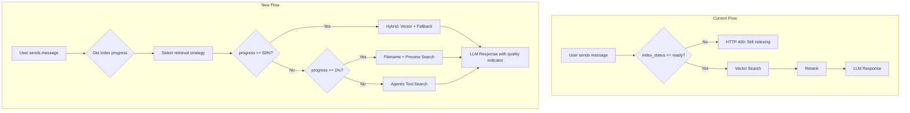

# feat: Progressive Search During Indexing

> **Related Plan:** See `plans/feat-indexing-speed-optimizations.md` for backend performance improvements.

## Overview

Enable users to start chatting immediately after adding files, even while indexing is in progress. Currently, users see a full-screen blocking overlay and cannot interact until indexing completes. This redesign implements progressive search enhancement with graceful degradation and optional agentic search for cold starts.

## Problem Statement

**Current Behavior:**
- Backend explicitly blocks chat requests when `index_status != "ready"` (`backend/app/routes/chat.py:332-336`)
- Frontend shows full-screen overlay (`IndexingProgress.tsx`) that prevents all interaction
- Message input is disabled with placeholder "Please wait for indexing to complete..."
- Users must wait for 100% indexing before any value can be extracted

**Impact:**
- Poor first-impression experience - users upload files and then wait
- No way to ask simple questions about file names/metadata while waiting
- Indexing is fast but blocking UX makes it feel slow
- Cold starts (new folders) have zero functionality until complete

## Proposed Solution

Implement a **progressive search enhancement** strategy with **graceful degradation**:

```
┌─────────────────────────────────────────────────────────────────────────┐
│  CURRENT: Blocking                                                       │
│  [Upload] → [Wait for 100%] → [Chat enabled]                            │
└─────────────────────────────────────────────────────────────────────────┘

┌─────────────────────────────────────────────────────────────────────────┐
│  NEW: Progressive Enhancement                                            │
│  [Upload] → [Chat immediately] → [Search improves as index builds]      │
│                                                                          │
│  Phase 0 (0%):    Agentic search via LLM tools (optional)               │
│  Phase 1 (1%+):   Filename + path matching                              │
│  Phase 2 (25%+):  + File preview search (first 500 chars)               │
│  Phase 3 (50%+):  + Partial vector search on indexed chunks             │
│  Phase 4 (100%):  Full semantic vector search + reranking               │
└─────────────────────────────────────────────────────────────────────────┘
```

## Technical Approach

### Architecture Changes



### Implementation Phases

#### Phase 1: Remove Blocking (Backend + Frontend)

**Files to modify:**

1. **`backend/app/routes/chat.py`**
   - Remove blocking check at line 332-336 and 715-719
   - Add `index_progress` to response for frontend quality indicator

```python
# backend/app/routes/chat.py:332-336 (REMOVE)
# if folder.index_status != "ready":
#     raise HTTPException(
#         status_code=400,
#         detail="Folder is still being indexed. Please wait.",
#     )

# ADD: Return index progress in streaming response
async def stream_response(...):
    # Include index status in initial message
    yield json.dumps({
        "type": "status",
        "index_progress": folder.files_indexed / folder.files_total if folder.files_total > 0 else 0,
        "index_status": folder.index_status,
    }) + "\n"
```

2. **`frontend/src/components/overlay/IndexingProgress.tsx`**
   - Convert from blocking overlay to non-blocking banner
   - Return banner component instead of full-screen overlay

```tsx
// frontend/src/components/overlay/IndexingProgress.tsx
// BEFORE: Full-screen blocking overlay
// AFTER: Non-blocking status banner

export function IndexingBanner({ status, folderName }: IndexingProgressProps) {
  if (status.status === 'ready') return null;

  return (
    <div className="bg-amber-50 border-b border-amber-200 px-4 py-2 text-sm">
      <div className="flex items-center gap-2">
        <Loader2 className="h-4 w-4 animate-spin text-amber-600" />
        <span>Indexing {folderName}: {status.files_indexed}/{status.files_total} files</span>
        <span className="text-amber-600">• Search may show limited results</span>
      </div>
    </div>
  );
}
```

3. **`frontend/src/pages/ChatPage.tsx`**
   - Enable input regardless of indexing status
   - Show banner instead of overlay
   - Remove `disabled={isIndexing}` from MessageInput

```tsx
// frontend/src/pages/ChatPage.tsx:278-281 (MODIFY)
{status && isIndexing && (
  <IndexingBanner status={status} folderName={folder?.folder_name} />
)}

// frontend/src/pages/ChatPage.tsx:311-316 (MODIFY)
<MessageInput
  disabled={false}  // Always enabled
  placeholder="Ask about your files..."
/>
```

4. **`frontend/src/components/chat/MessageInput.tsx`**
   - Remove disabled state handling for indexing

---

#### Phase 2: Implement Progressive Retrieval

**New file: `backend/app/services/progressive_retrieval.py`**

```python
# backend/app/services/progressive_retrieval.py
from enum import Enum
from dataclasses import dataclass
from typing import Optional

class RetrievalQuality(str, Enum):
    AGENTIC = "agentic"      # LLM-guided grep/find
    FILENAME = "filename"    # Filename matching only
    PREVIEW = "preview"      # Filename + file preview
    PARTIAL = "partial"      # Partial vector search
    FULL = "full"           # Complete vector + rerank

@dataclass
class RetrievalResult:
    chunks: list[dict]
    quality: RetrievalQuality
    message: str
    indexed_percent: float

async def progressive_retrieve(
    db: AsyncSession,
    folder_id: str,
    query: str,
    folder_status: str,
    files_indexed: int,
    files_total: int,
) -> RetrievalResult:
    """Select retrieval strategy based on index progress."""

    progress = files_indexed / files_total if files_total > 0 else 0

    if progress >= 0.5:
        # Hybrid: vector search on indexed + filename on pending
        chunks = await hybrid_retrieve(db, folder_id, query)
        return RetrievalResult(
            chunks=chunks,
            quality=RetrievalQuality.PARTIAL,
            message=f"Searching {int(progress * 100)}% of indexed files",
            indexed_percent=progress,
        )

    elif progress >= 0.01:
        # Filename + preview search
        chunks = await filename_preview_search(db, folder_id, query)
        return RetrievalResult(
            chunks=chunks,
            quality=RetrievalQuality.PREVIEW,
            message="Searching file names and previews while index builds",
            indexed_percent=progress,
        )

    else:
        # No index yet - use file metadata only
        chunks = await filename_search(db, folder_id, query)
        return RetrievalResult(
            chunks=chunks,
            quality=RetrievalQuality.FILENAME,
            message="Searching file names only - index building",
            indexed_percent=progress,
        )


async def filename_search(db: AsyncSession, folder_id: str, query: str) -> list[dict]:
    """Search files by name, path, and MIME type."""
    query_terms = query.lower().split()

    result = await db.execute(
        select(File)
        .where(File.folder_id == folder_id)
        .where(
            or_(*[
                File.file_name.ilike(f"%{term}%")
                for term in query_terms
            ])
        )
        .limit(10)
    )
    files = result.scalars().all()

    return [
        {
            "file_id": str(f.id),
            "file_name": f.file_name,
            "content": f.file_preview or f"File: {f.file_name}",
            "score": 0.5,  # Default score for filename matches
        }
        for f in files
    ]


async def filename_preview_search(db: AsyncSession, folder_id: str, query: str) -> list[dict]:
    """Search file names and preview text."""
    query_terms = query.lower().split()

    result = await db.execute(
        select(File)
        .where(File.folder_id == folder_id)
        .where(
            or_(
                *[File.file_name.ilike(f"%{term}%") for term in query_terms],
                *[File.file_preview.ilike(f"%{term}%") for term in query_terms],
            )
        )
        .limit(15)
    )
    files = result.scalars().all()

    return [
        {
            "file_id": str(f.id),
            "file_name": f.file_name,
            "content": f.file_preview or "",
            "score": 0.6,
        }
        for f in files
    ]


async def hybrid_retrieve(db: AsyncSession, folder_id: str, query: str) -> list[dict]:
    """Combine vector search on indexed chunks with filename search."""
    from app.services.retrieval import vector_search
    from app.services.embedding import embed_query

    # Vector search on indexed chunks
    query_embedding = await embed_query(query)
    vector_results = await vector_search(db, folder_id, query_embedding, limit=10)

    # Filename search for unindexed files
    filename_results = await filename_preview_search(db, folder_id, query)

    # Merge with RRF (Reciprocal Rank Fusion)
    return reciprocal_rank_fusion(vector_results, filename_results)


def reciprocal_rank_fusion(
    *result_lists: list[dict],
    k: int = 60,
) -> list[dict]:
    """Merge multiple result lists using RRF."""
    scores = {}
    items = {}

    for results in result_lists:
        for rank, item in enumerate(results):
            doc_id = item.get("chunk_id") or item.get("file_id")
            if doc_id not in scores:
                scores[doc_id] = 0
                items[doc_id] = item
            scores[doc_id] += 1.0 / (k + rank + 1)

    sorted_ids = sorted(scores.keys(), key=lambda x: scores[x], reverse=True)
    return [items[doc_id] for doc_id in sorted_ids[:15]]
```

**Modify: `backend/app/routes/chat.py`**

```python
# backend/app/routes/chat.py - update retrieve_chunks function
from app.services.progressive_retrieval import progressive_retrieve

async def retrieve_chunks(
    db: AsyncSession,
    folder: Folder,
    query: str,
) -> tuple[list[dict], str]:
    """Retrieve chunks using progressive strategy based on index status."""

    result = await progressive_retrieve(
        db=db,
        folder_id=str(folder.id),
        query=query,
        folder_status=folder.index_status,
        files_indexed=folder.files_indexed,
        files_total=folder.files_total,
    )

    return result.chunks, result.message
```

---

#### Phase 3: Add Agentic Search Tool (Optional)

**New file: `backend/app/services/agentic_search.py`**

```python
# backend/app/services/agentic_search.py
"""LLM-guided search for cold starts when no vector index exists."""

import json
from anthropic import AsyncAnthropic

SEARCH_TOOLS = [
    {
        "name": "search_filenames",
        "description": "Search files by name pattern. Returns matching file names and paths.",
        "input_schema": {
            "type": "object",
            "properties": {
                "pattern": {
                    "type": "string",
                    "description": "Search pattern to match against file names"
                }
            },
            "required": ["pattern"]
        }
    },
    {
        "name": "search_file_content",
        "description": "Search within file previews for specific text. Use when looking for content.",
        "input_schema": {
            "type": "object",
            "properties": {
                "query": {
                    "type": "string",
                    "description": "Text to search for in file content"
                }
            },
            "required": ["query"]
        }
    },
    {
        "name": "list_files",
        "description": "List all files in the folder with their types and sizes.",
        "input_schema": {
            "type": "object",
            "properties": {}
        }
    }
]


async def agentic_search(
    db: AsyncSession,
    folder_id: str,
    user_query: str,
    anthropic_client: AsyncAnthropic,
) -> list[dict]:
    """Use LLM with tools to find relevant files."""

    messages = [
        {
            "role": "user",
            "content": f"""Find files relevant to this question: "{user_query}"

Use the available tools to search the folder and return the most relevant files."""
        }
    ]

    response = await anthropic_client.messages.create(
        model="claude-sonnet-4-20250514",
        max_tokens=1024,
        tools=SEARCH_TOOLS,
        messages=messages,
    )

    results = []
    for content in response.content:
        if content.type == "tool_use":
            tool_result = await execute_search_tool(
                db, folder_id, content.name, content.input
            )
            results.extend(tool_result)

    return results[:10]


async def execute_search_tool(
    db: AsyncSession,
    folder_id: str,
    tool_name: str,
    tool_input: dict,
) -> list[dict]:
    """Execute a search tool and return results."""

    if tool_name == "search_filenames":
        return await filename_search(db, folder_id, tool_input["pattern"])

    elif tool_name == "search_file_content":
        return await filename_preview_search(db, folder_id, tool_input["query"])

    elif tool_name == "list_files":
        result = await db.execute(
            select(File)
            .where(File.folder_id == folder_id)
            .limit(50)
        )
        files = result.scalars().all()
        return [
            {
                "file_id": str(f.id),
                "file_name": f.file_name,
                "content": f"File: {f.file_name} ({f.mime_type})",
                "score": 0.3,
            }
            for f in files
        ]

    return []
```

---

#### Phase 4: Update Frontend Status Indicators

**New component: `frontend/src/components/chat/SearchQualityIndicator.tsx`**

```tsx
// frontend/src/components/chat/SearchQualityIndicator.tsx

interface SearchQualityIndicatorProps {
  quality: 'full' | 'partial' | 'preview' | 'filename' | 'agentic';
  indexedPercent: number;
}

export function SearchQualityIndicator({
  quality,
  indexedPercent
}: SearchQualityIndicatorProps) {
  const qualityMessages = {
    full: null, // No indicator needed
    partial: `Searching ${Math.round(indexedPercent * 100)}% of indexed content`,
    preview: 'Searching file names and previews',
    filename: 'Searching file names only',
    agentic: 'Using AI-guided search',
  };

  const message = qualityMessages[quality];
  if (!message) return null;

  return (
    <div className="flex items-center gap-1.5 text-xs text-muted-foreground mb-2">
      <div className="h-1.5 w-1.5 rounded-full bg-amber-400" />
      <span>{message}</span>
    </div>
  );
}
```

**Update: `frontend/src/hooks/useFolderStatus.ts`**

```tsx
// Remove blocking behavior, keep for progress tracking only
export function useFolderStatus(folderId: string | null) {
  // ... existing polling logic ...

  // Change return value - don't expose isIndexing as blocking signal
  return {
    status,
    isLoading,
    error,
    progress: status ? status.files_indexed / status.files_total : 0,
    isComplete: status?.status === 'ready',
  };
}
```

---

## Acceptance Criteria

### Functional Requirements

- [ ] Users can send chat messages immediately after folder creation
- [ ] Chat input is never disabled due to indexing status
- [ ] No full-screen blocking overlay during indexing
- [ ] Search results include quality indicator when index is incomplete
- [ ] Filename/preview search works when index is 0-50% complete
- [ ] Hybrid search (vector + filename) works when index is 50%+ complete
- [ ] Full vector search + reranking when index is 100% complete

### Non-Functional Requirements

- [ ] Response time < 2s for filename/preview search
- [ ] Response time < 3s for hybrid search
- [ ] No degradation of fully-indexed search quality
- [ ] Graceful error handling if search fails during indexing

### Testing Requirements

- [ ] Unit tests for `progressive_retrieval.py` with different index states
- [ ] Integration test: send chat at 0%, 25%, 50%, 75%, 100% index
- [ ] Frontend test: verify no blocking overlay
- [ ] E2E test: upload folder → immediately send message → receive response

## Files to Create/Modify

### Backend (Python)

| File | Action | Purpose |
|------|--------|---------|
| `backend/app/services/progressive_retrieval.py` | CREATE | Progressive retrieval logic |
| `backend/app/services/agentic_search.py` | CREATE | LLM tool-based search (optional) |
| `backend/app/routes/chat.py:332-336` | MODIFY | Remove blocking check |
| `backend/app/routes/chat.py:715-719` | MODIFY | Remove blocking check |
| `backend/app/routes/chat.py:100-159` | MODIFY | Use progressive_retrieve |

### Frontend (TypeScript/React)

| File | Action | Purpose |
|------|--------|---------|
| `frontend/src/components/overlay/IndexingProgress.tsx` | MODIFY | Convert to non-blocking banner |
| `frontend/src/components/chat/SearchQualityIndicator.tsx` | CREATE | Show search quality |
| `frontend/src/pages/ChatPage.tsx:278-281` | MODIFY | Use banner instead of overlay |
| `frontend/src/pages/ChatPage.tsx:311-316` | MODIFY | Enable input always |
| `frontend/src/components/chat/MessageInput.tsx` | MODIFY | Remove disabled logic |
| `frontend/src/hooks/useFolderStatus.ts` | MODIFY | Remove blocking signal |

## Alternative Approaches Considered

### Option A: Agentic Search Only (Not Recommended)
- **Pros:** Works immediately with zero index, very flexible
- **Cons:** Higher latency (requires LLM tool calls), higher cost, may be less accurate than vector search

### Option B: Wait for Minimum Index (Not Recommended)
- **Pros:** Simpler implementation, guaranteed search quality
- **Cons:** Still blocks users, doesn't solve the core UX problem

### Option C: Progressive Enhancement (SELECTED)
- **Pros:** Immediate availability, graceful degradation, maintains search quality as index builds
- **Cons:** Slightly more complex implementation, need to communicate quality to users

## Success Metrics

1. **Time to first message**: 0 seconds (currently blocked until indexing complete)
2. **User satisfaction**: No blocking overlay frustration
3. **Search quality preservation**: Full quality when index complete
4. **Error rate**: <1% failed searches during partial indexing

## Edge Cases and Gaps to Address

### Critical (Must resolve before implementation)

| Gap | Issue | Recommendation |
|-----|-------|----------------|
| Failed indexing | What if `index_status == "failed"`? | Show error banner but allow chat with filename-only for any files that succeeded |
| Empty folder | `files_total = 0` causes division by zero | Return 0 progress, show "No files to index", disable chat with helpful message |
| Zero search results | Filename search returns nothing at early indexing | Return response with "No matching files found yet. Indexing is X% complete." |
| Embedding failure | `embed_query()` fails during hybrid search | Fall back to filename-only search with warning in response |

### Important (Significantly affects UX)

| Gap | Issue | Recommendation |
|-----|-------|----------------|
| Quality indicator location | Where to show `SearchQualityIndicator`? | Display above assistant message when quality is not "full" |
| Response payload | Frontend needs search quality in streaming response | Add `search_quality` and `search_message` to initial status event |
| Agentic search scope | Is it enabled by default? | **Disabled for MVP** - use filename-only at 0%, add agentic as Phase 2 |
| Partial file failures | Some files succeed, some fail | Use `files_indexed` count but note in banner: "X files could not be processed" |

### Additional Acceptance Criteria (from SpecFlow analysis)

- [ ] When `index_status == "failed"`, show error banner but allow filename-only chat for succeeded files
- [ ] When `files_total == 0`, show "No files to search" message and disable chat
- [ ] When search returns zero results, response includes "No matching files found during indexing"
- [ ] Streaming response includes `search_quality` field: `"full" | "partial" | "preview" | "filename"`
- [ ] Streaming response includes `search_message` field with user-friendly explanation
- [ ] If embedding service fails, fall back to filename search with warning
- [ ] SearchQualityIndicator displays above assistant message (not in banner)
- [ ] Store file-level failure count and display in banner: "3 files could not be processed"

## Dependencies

- No new external dependencies required
- Uses existing Anthropic SDK for optional agentic search (Phase 2)
- Uses existing pgvector and embedding infrastructure

## References

### Internal References
- Current indexing worker: `backend/app/worker.py:132-248`
- Current blocking check: `backend/app/routes/chat.py:332-336`
- Current overlay component: `frontend/src/components/overlay/IndexingProgress.tsx`
- Embedding service: `backend/app/services/embedding.py`
- Retrieval service: `backend/app/services/retrieval.py`

### External References
- [Azure Async Request-Reply Pattern](https://learn.microsoft.com/en-us/azure/architecture/patterns/async-request-reply)
- [Reciprocal Rank Fusion Algorithm](https://plg.uwaterloo.ca/~gvcormac/cormacksigir09-rrf.pdf)
- [Claude Code Agentic Search Pattern](https://www.qwan.eu/2025/05/01/agentic-search.html)
- [FastAPI Background Tasks](https://fastapi.tiangolo.com/tutorial/background-tasks/)
- [React 18 Suspense Patterns](https://react.dev/reference/react/Suspense)
